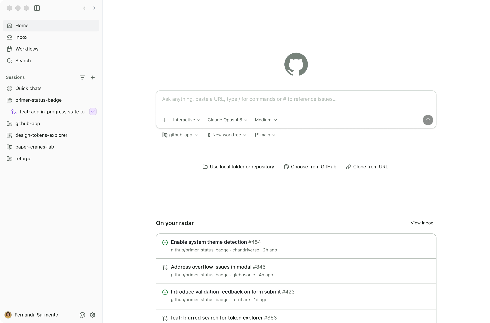

# GitHub app

The GitHub app is a desktop application for agent-driven development that brings parallel workstreams, GitHub integration, and PR lifecycle management into one place.

> **Availability:** The GitHub app is in public preview. Copilot Business and Enterprise subscribers have access today. Copilot Pro and Pro+ subscribers can [sign up for early access](https://gh.io/github-app).

## Introduction and overview

The GitHub app is a desktop application purpose-built for agent-driven development. It gives you a single place to direct AI agents across parallel workstreams, work with GitHub issues and pull requests, and manage the full development lifecycle—without context-switching between terminals, IDEs, and browser tabs.

The app is built on GitHub Copilot CLI and integrates natively with GitHub, so your repositories, branches, and CI pipelines work out of the box. It's designed for workflows where you want to run multiple agents in parallel and stay focused on directing work rather than doing it all yourself.

## Getting started

### Prerequisites

Make sure [Git](https://github.com/git-guides/install-git) is installed.

You'll also need an active [Copilot subscription](https://github.com/features/copilot/plans).

### Install

Download the app for your platform:

**Recommended**

- [Mac (Apple Silicon)](../../releases/latest/download/GitHub-darwin-arm64.dmg)
- [Windows](../../releases/latest/download/GitHub-windows-x64-setup.exe)
- [Linux](../../releases/latest/download/GitHub-linux-x64.AppImage)

**Alternate / older devices**

- [Mac (Intel)](../../releases/latest/download/GitHub-darwin-x64.dmg)
- [Windows (ARM)](../../releases/latest/download/GitHub-windows-arm64-setup.exe)

You can also browse all builds on the [Releases](../../releases) page.

For setup and a walkthrough of your first session, see the [documentation](https://gh.io/github-app-docs).

## This repository

This repo is the public home for the GitHub app. Use it to:

- Download releases from the [Releases](../../releases) page
- File bugs and feature requests
- Join discussions
- Read release notes in [`changelog.md`](./changelog.md)

The application source lives elsewhere; this repo is for releases, issues, and discussion.

## Feedback and issues

Use the issue forms in this repository to report a bug or propose an improvement, join [Discussions](https://github.com/github/app/discussions/3), or send feedback from within the app. When filing an issue, please include:

- The app version
- Your operating system and version
- Steps to reproduce
- Expected vs. actual behavior
- Screenshots or logs

